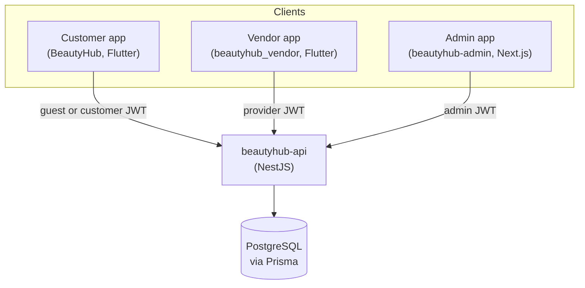
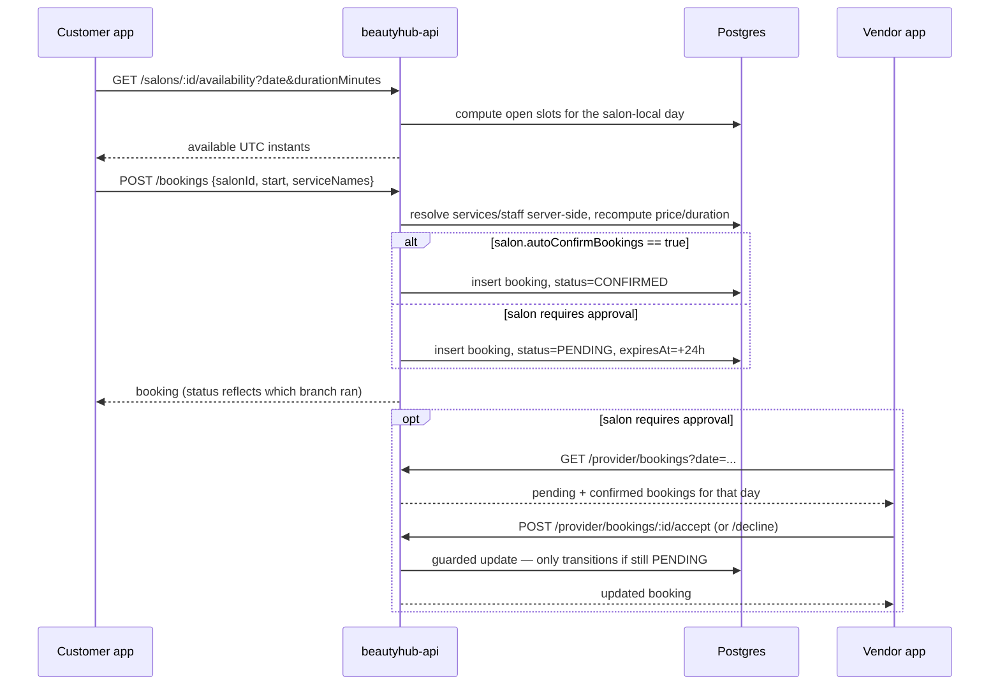

# 00 — Overview

## What BeautyHub is

A multi-vendor marketplace connecting customers to salons/barbershops in
South Africa. Three user types, three clients, one backend:

| User type | Client | What they do |
|---|---|---|
| Customer | `BeautyHub` (Flutter) | Browse salons, book appointments, manage their bookings |
| Salon/barbershop owner ("provider") | `beautyhub_vendor` (Flutter) | Manage their salon listing, services, staff, and respond to bookings |
| Internal staff | `beautyhub-admin` (Next.js) | Administer salons, users, and bookings platform-wide |

All three are thin clients over one backend, `beautyhub-api`. No client talks
to the database directly, and none of them share code with each other — each
Flutter app has its own copy of near-identical infrastructure (formatters,
theme, API client shape). That duplication is deliberate for now (two small,
independently-deployable apps beat one shared package this early), not an
oversight — don't be surprised there's no shared Dart package between them.

## System diagram

## Route surface, at a glance

The backend exposes five route groups, each gated by role. This is the
fastest way to see which client owns which part of the API surface — full
detail in [01 — Backend](./01-backend.md).

| Route prefix | Guard | Used by |
|---|---|---|
| `/auth/*` | Mostly public (register/login/guest/reset) | All three clients |
| `/salons/*` | Public | Customer app (browse, salon detail, availability) |
| `/bookings/*` | Any authenticated user | Customer app (create/list/cancel own bookings) |
| `/provider/*` | `Role.PROVIDER`, scoped to caller's own salon | Vendor app |
| `/admin/*` | `Role.ADMIN` | Admin app |

There's no API gateway or BFF layer — every client calls `beautyhub-api`
directly over plain REST/JSON, no GraphQL, no gRPC.

## Identity model

One `User` table backs all three clients; a `role` enum (`CUSTOMER` /
`PROVIDER` / `ADMIN`) and an `isGuest` flag distinguish who's calling. There's
no separate "guest token" type — a guest is just a `User` row with
`isGuest: true` and no password, and its JWT looks exactly like anyone else's.

| Client | How identity is obtained | Notable behavior |
|---|---|---|
| Customer app | Auto-provisions a **guest** identity on first launch (`POST /auth/guest`), or the user registers/logs in for real | Guest tokens are silently re-minted on 401 (never strands the user); a *registered* user's 401 throws `SessionExpiredException` instead — the app never re-mints a signed-in identity |
| Vendor app | **Login only** — no guest, no self-registration. Accounts are seeded/created out-of-band ("Contact partners@beautyhub.app to get listed") | Login itself rejects non-provider accounts client-side, 403, before the token is ever stored. Any other 401 just clears the token and throws — the app does *not* auto-navigate to `/login` from mid-session, only from the splash screen |
| Admin app | **Login only**, same rejection pattern for non-admin accounts | JWT stored in a plain (non-httpOnly) cookie; the real authorization boundary is the backend's `@Roles(ADMIN)` guard — the app's own JWT-role check is UI gating only, and the code says so in a comment |

Full detail: [01 — Backend § Auth model](./01-backend.md#3-auth-model).

## A booking's life cycle, end to end

This is the one flow that touches every layer of the system, so it's worth
tracing in full as an orientation exercise.

Key things this flow demonstrates:
- **The server, never the client, decides the price.** `POST /bookings` looks
  up live `SalonService` rows by name/id — a client can't book a discount by
  sending a lower price.
- **Double-booking is prevented at the database level**, not just in
  application code — a Postgres exclusion constraint (`EXCLUDE USING gist`)
  makes two overlapping bookings at the same salon impossible to commit
  concurrently, even under a race. See
  [01 — Backend § DB-level invariants](./01-backend.md#db-level-invariants-migrations-not-visible-in-schemaprisma-alone).
- **`autoConfirmBookings` is the one flag that changes everything downstream**
  — it decides whether a booking needs a human on the vendor side to look at
  it at all. Both client apps have UI specifically built around telling the
  customer the truth about which mode they're in (see
  [03 — Vendor app § Booking-request flow](./03-vendor-app.md#booking-requests-vetting-flow-the-single-most-important-business-logic-in-this-app)).

## Cross-cutting rules that apply everywhere

These aren't obvious from reading any single repo — full detail in
[05 — Conventions & gotchas](./05-conventions-and-gotchas.md):

- **UTC on the wire, salon-local for wall-clock fields.** Every timestamp
  crossing the network is UTC ISO-8601. `Salon.openHour`/`closeHour` and any
  `date=YYYY-MM-DD` query param are the salon market's *local* time
  (currently one process-wide `SALON_TIMEZONE`, default
  `Africa/Johannesburg` — not per-salon yet).
- **Currency is ZAR, and the backend doesn't know that.** The API moves bare
  numbers; every client is independently responsible for formatting them as
  Rand. There are now *three* independent formatter implementations (one per
  client) — if the currency or locale ever changes, all three need editing.
- **Errors are typed, and screens never show a raw exception.** Both Flutter
  apps map backend errors to user-facing text through a single function
  (`friendlyErrorMessage`); the admin app maps them through its own
  `ApiError` class. If you add a new backend error case, you need to teach
  *all three* clients about it independently — nothing propagates
  automatically.

## Reading order for a new hire

1. This page.
2. [05 — Conventions & gotchas](./05-conventions-and-gotchas.md) — the rules
   that'll bite you fastest if you skip them.
3. [06 — Local dev setup](./06-local-dev-setup.md) — get everything running.
4. [01 — Backend](./01-backend.md) — read this regardless of which client
   you're assigned; it's the shared contract all three depend on.
5. Whichever client doc matches your actual work
   ([02](./02-customer-app.md) / [03](./03-vendor-app.md) / [04](./04-admin-app.md)).
